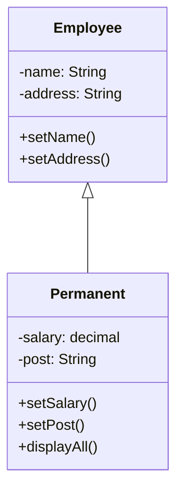

# PHP Complete Guide

&nbsp;[Bidur Sapkota](https://www.bidursapkota.com.np/)


## Table of Contents

1. [Introduction to Server Side Scripting](#introduction-to-server-side-scripting)
2. [PHP Basics](#php-basics)
3. [Control Structures](#control-structures)
4. [Arrays and Functions](#arrays-and-functions)
5. [Form Handling](#form-handling)
6. [File Operations](#file-operations)
7. [Sessions and Cookies](#sessions-and-cookies)
8. [Database Operations](#database-operations)
9. [AJAX](#ajax)
10. [Object-Oriented Programming](#object-oriented-programming)
11. [Lab 3 - PHP](#lab-3---php)
12. [Lab 4 - PHP & MySQL](#lab-4---php--mysql)
13. [Lab 5 - AJAX](#lab-5---ajax)
14. [Lab 6 - OOP with PHP](#lab-6---oop-with-php)

---

## Introduction to Server Side Scripting

Server-side scripting is a technique where **scripts are executed on the web server to generate dynamic web pages**. Unlike client-side scripting (JavaScript), server-side scripts run on the server before sending the result to the browser.

**Advantages:**

- Dynamic content generation
- Database interaction
- Secure processing (code not visible to users)
- Session management / Authentication

Common server-side scripting languages include PHP, Python, Ruby, JavaScript (Node.js),
Java

**FUN**

```js
// chrome://dino/
Runner.prototype.gameOver = function () {};
```

---

---

---

## PHP Basics

**PHP (Hypertext Preprocessor)** is a popular open-source server-side scripting language designed for web development.

### Basic PHP Syntax

PHP code is embedded within HTML using special tags. Files use `.php` extension.

```php
<?php
    echo "Hello, World!";
?>
```

**Key Points:**

- PHP code starts with `<?php` and ends with `?>`
- Statements end with semicolon (`;`)
- PHP files can contain HTML, CSS, JavaScript, and PHP code

```php
<!DOCTYPE html>
<html>
<body>
    <h1>My PHP Page</h1>
    <?php
        echo "<p>This is generated by PHP</p>";
    ?>
</body>
</html>
```

### Comments in PHP

Comments are used to document code and are ignored during execution.

```php
<?php
    // Single-line comment

    # Another single-line comment

    /*
        Multi-line comment
        Can span multiple lines
    */

    echo "Comments help explain code"; // Inline comment
?>
```

### Variables

Variables store data values. In PHP, variables start with `$` followed by the variable name.

**Old Question:**

**Write rules to create variable in PHP.**

**Rules:**

- Start with `$` sign
- Must begin with a letter or underscore
- Can only contain alphanumeric characters and underscores
- Case-sensitive
- PHP is a loosely typed language, which means you don't need to declare the data type of a
  variable.

### Data Types

PHP data types are used to hold different types of data or values. PHP supports 8 primitive
data types that can be categorized further in 3 types:

- **Scalar Types (predefined) (Stores single value)**
  - String
  - Integer
  - Float
  - Boolean

```php
<?php
$name = "John";           // String
$age = 25;                // Integer
$price = 19.99;           // Float
$is_student = true;       // Boolean

echo "Name: $name<br>";
echo "Age: $age<br>";
echo "Price: $price<br>";
echo "Hello, " . $name . "!"; // Variable concatenation
?>
```

- **Compound Types (user-defined)**
  - Array
  - Object

```php
<?php
$arrayVar = array("apple", "banana", "cherry"); // Array

class Car
{
    public $model;

    public function __construct()
    {
        $this->model = "S";
    }
}
$tesla = new Car();  // Object

print_r($tesla);
?>
```

- **Special Types**
  - Resource (holds reference to the external resources like files, database, etc)
  - NULL (variables with no value)

```php
<?php
$nullVar = NULL;

$resourceVar = fopen("file.txt", "r");
$conn = mysqli_connect("localhost", "username", "password", "database");
?>
```

### Strings

#### Single-Quoted Strings

In single-quoted strings, variables and escape sequences (except for `\\` and `\'`) are not
interpreted.

```php
<?php
$variable = 'something';
$singleQuotedString = '$variable will not be parsed.\n';
echo $singleQuotedString;
// Output: $variable will not be parsed.\n
?>
```

#### Double-Quoted Strings

Double-quoted strings allow for variable interpolation and interpretation of certain escape
sequences.

```php
<?php
$variable = 'something';
$doubleQuotedString = "\n\n$variable will be parsed.\n\n";
echo $doubleQuotedString;
// Output: something will be parsed.
?>
```

#### String Functions

- `strlen();` [Returns length of strings]
- `strpos();` [Returns position of first occurance of a substring in string]
- `substr();` [Retruns a part of a string]
- `str_replace();` [Replaces all occurrences of a search string with a replacement string.]
- `strtolower();` and `strtoupper();`
- `trim();` [Strips whitespace from the beginning and end of a string.]
- `explode()` and `implode()`
  - Splits a string by a delimiter into an array (explode()) or joins array elements into a string (implode()).

```php
<?php
echo strlen("Hello, world!"); // Output: 13
echo strpos("Hello, world!", "world"); // Output: 7
echo substr("Hello, world!", 7, 5); // Output: world
echo str_replace("world", "PHP", "Hello, world!"); // Output: Hello, PHP!
echo strtolower("HELLO, WORLD!"); // Output: hello, world!
echo strtoupper("hello, world!"); // Output: HELLO, WORLD!
echo trim(" Hello, world! "); // Output: Hello, world!
$array = explode(", ", "Hello, world!");
print_r($array); // Output: Array ( [0] => Hello [1] => world! )
$string = implode(" ", $array);
echo $string; // Output: Hello world!
?>
```

### String Interpolation

PHP supports string interpolation, which allows you to embed variables and expressions
within strings.

```php
<?php
$language = 'PHP';
echo "I love $language!"; // Output: I love PHP!
?>
```

### Superglobals

**Old Question:**

**What do you mean by super global variable in PHP?**

Superglobals are built-in variables in PHP that are always accessible, regardless of scope.

Superglobals are specially named arrays that contain various types of information about the
server, environment, request, and more.

PHP provides several built-in superglobals that are available in all scopes:

`$GLOBALS`, `$_SERVER`, `$_REQUEST`, `$_POST`, `$_GET`, `$_FILES`, `$_ENV`,
`$_COOKIE`, `$_SESSION`

```php
<?php
$variable = "Hello, World!";
echo $GLOBALS['variable']; // Output: Hello, World!
echo $_SERVER['PHP_SELF']; // Outputs the filename of the currently executing script

$name = $_GET['username']; // accessing email data of get request
$email = $_POST['email']; // accessing email data of post request
?>
```

### PHP Operators

Operators are used to perform operations on variables and values.

#### Arithmetic Operators

These operators are used to perform common arithmetic operations.

- `+` Addition
- `-` Subtraction
- `*` Multiplication
- `/` Division
- `%` Modulus
- `**` Exponentiation

```php
<?php
    $a = 10;
    $b = 3;

    echo $a + $b;  // Addition: 13
    echo $a - $b;  // Subtraction: 7
    echo $a * $b;  // Multiplication: 30
    echo $a / $b;  // Division: 3.333...
    echo $a % $b;  // Modulus: 1
    echo $a ** $b; // Exponentiation: 1000
?>
```

#### Assignment Operators

These operators are used to assign values to variables.

- `=` Assign
- `+=` Add and assign
- `-=` Subtract and assign
- `*=` Multiply and assign
- `/=` Divide and assign
- `%=` Modulus and assign
- `**=` Exponentiation and assign

```php
<?php
    $x = 10;
    $x += 5;  // $x = $x + 5; Result: 15
    $x -= 3;  // $x = $x - 3; Result: 12
    $x *= 2;  // $x = $x * 2; Result: 24
    $x /= 4;  // $x = $x / 4; Result: 6
?>
```

#### Comparison Operators

These operators are used to compare two values.

- `==` Equal
- `===` Identical (equal and same type)
- `!=` Not equal
- `<>` Not equal
- `!==` Not identical (not equal or not same type)
- `>` Greater than
- `<` Less than
- `>=` Greater than or equal to
- `<=` Less than or equal to
- `<=>` Spaceship operator (returns -1, 0, or 1 when `$a` is less than, equal to, or greater than `$b`)

```php
<?php
    $a = 5;
    $b = "5";

    var_dump($a == $b);   // Equal: true
    var_dump($a === $b);  // Identical: false (different types)
    var_dump($a != $b);   // Not equal: false
    var_dump($a !== $b);  // Not identical: true
    var_dump($a > 3);     // Greater than: true
    var_dump($a < 10);    // Less than: true
    var_dump(5 <=> 10);   // int(-1)
?>
```

#### Increment/Decrement Operators

These operators are used to increment or decrement a variable's value.

- `++$var` Pre-increment
- `$var++` Post-increment
- `--$var` Pre-decrement
- `$var--` Post-decrement

```php
<?php
$a = 5;

$a++;
--$a;
?>
```

#### Logical Operators

These operators are used to combine conditional statements.

- `&&` AND
- `||` OR
- `!` NOT

```php
<?php
    $x = true;
    $y = false;

    var_dump($x && $y);  // AND: false
    var_dump($x || $y);  // OR: true
    var_dump(!$x);       // NOT: false
?>
```

#### String Operators

These operators are used to manipulate strings.

- `.` Concatenation
- `.=` Concatenate and assign

```php
<?php
$a2 = "apple";
$a2 .= " ball";    // apple ball
var_dump($a2);
?>
```

#### Array Operators

These operators are used to compare arrays.

- `+` Union - Combines two arrays, but only includes elements from the first array that are not present in the second array
- `==` Equality - Returns true if $x and $y have the same key/value pairs
- `===` Identity – Equality plus in the same order and of the same types
- `!=` Inequality
- `<>` Inequality
- `!==` Non-identity

```php
<?php
// + Union of arrays
$arr1 = array("phy" => 70, "che" => 80, "math" => 90);
$arr2 = array("Eng" => 70, "Bio" => 80, "CompSci" => 90, "phy" => 60);
$arr3 = $arr1 + $arr2;
var_dump($arr3);

// == Equality
$array3 = [1, 2, 3];
$array4 = [1, 2, 3];
$resultEqual = ($array3 == $array4);
var_dump($resultEqual); // Output: bool(true)

// === Identity
$resultIdentical = ($array3 === $array4);
var_dump($resultIdentical); // Output: bool(true)

// != Inequality
$array5 = [1, 2, 3];
$array6 = [4, 5, 6];
$resultNotEqual = ($array5 != $array6);
var_dump($resultNotEqual); // Output: bool(true)

// <> Inequality
$resultNotEqualAlt = ($array5 <> $array6);
var_dump($resultNotEqualAlt); // Output: bool(true)

// !== Non-identity
$resultNotIdentical = ($array5 !== $array6);
var_dump($resultNotIdentical); // Output: bool(true)
?>
```

#### Type Operators

These operators are used to check the type of a variable.

- `instanceof` Used to determine if an object is an instance of a specific class

```php
<?php
class MyClass {}

$myObject = new MyClass();
if ($myObject instanceof MyClass) {
    echo 'Yes, $myObject is an instance of MyClass.';
} else {
    echo 'No, $myObject is not an instance of MyClass.';
}
echo "<br>";

// $a = 3;
// echo gettype($a);
?>
```

#### Error Control Operators

These operators are used to suppress errors.

- `@` Suppress error

```php
<?php
$file = @fopen("php\\examples.txt", "r");
?>
```

#### Execution Operators

These operators are used to execute shell commands.

- `dir` Backticks (executes shell commands)

```php
<?php
$listing = `cd php && dir`;
// echo $listing;
?>
```

#### Null Coalescing Operator

This operator is used to provide a default value if a variable is null.

- `??` Null coalescing (introduced in PHP 7)

```php
<?php
$left;
$right = 20;
$result = $left ?? $right;
// $result = isset($left) ? $left : $right;
var_dump($result);
?>
```

#### Ternary Operator

This operator is a shorthand for the `if` statement.

- `? :` Ternary

```php
<?php
$left;
$right = 20;
$result = isset($left) ? $left : $right;
var_dump($result);
?>
```

### PHP Date Function

**date(format, timestamp)**

| Argument                 | Meaning                                                       |
| ------------------------ | ------------------------------------------------------------- |
| `format`                 | String that defines how the date should look. (Eg: `"Y-m-d"`) |
| `timestamp` _(optional)_ | Unix timestamp number. If not given → PHP uses current time   |

| Symbol      | Meaning                  | Example |
| ----------- | ------------------------ | ------- |
| Y           | 4-digit year             | 2025    |
| m           | 2-digit month            | 11      |
| d           | 2-digit day              | 05      |
| H           | hour (00-23)             | 14      |
| i           | minutes                  | 30      |
| s           | seconds                  | 45      |
| h           | hour (01-12)             | 02      |
| A           | AM / PM                  | PM      |
| l (lower L) | full weekday name        | Friday  |
| F           | full month name          | March   |
| j           | day without leading zero | 5       |

**time()**

| Function | Meaning                                                      |
| -------- | ------------------------------------------------------------ |
| `time()` | returns current Unix timestamp (seconds from 1 Jan 1970 UTC) |

**mktime(hour, minute, second, month, day, year)**

| Arg    | Meaning      |
| ------ | ------------ |
| hour   | 0–23         |
| minute | 0–59         |
| second | 0–59         |
| month  | 1–12         |
| day    | 1–31         |
| year   | 4-digit year |

**strtotime(string, base_timestamp?)**

| Argument                      | Meaning                                                     |
| ----------------------------- | ----------------------------------------------------------- |
| `string`                      | human-readable date expression → PHP converts to timestamp. |
| `base_timestamp` _(optional)_ | default = `time()` (now)                                    |

Examples of valid strings:

| Example string  | Meaning                 |
| --------------- | ----------------------- |
| `"next Monday"` | next coming Monday date |
| `"+1 week"`     | adds 7 days             |
| `"2024-03-15"`  | specific date           |
| `"+2 months"`   | 2 months ahead          |

```php
<?php
// Current date and time
echo date("Y-m-d H:i:s") . '<br>';  // 2024-03-15 14:30:45

// Different formats
echo date("d/m/Y") . '<br>';        // 15/03/2024
echo date("l, F j, Y") . '<br>';    // Friday, March 15, 2024
echo date("h:i A") . '<br>';        // 02:30 PM

// Timestamp
$timestamp = time();
echo $timestamp . '<br>';    // 1762324996
echo date("Y-m-d", $timestamp) . '<br>';    // 2025-11-05

// Custom date
$date = mktime(12, 30, 0, 3, 15, 2024);
echo date("Y-m-d H:i:s", $date) . '<br>';    // 2024-03-15 12:30:00

// strtotime function
echo date("Y-m-d", strtotime("next Monday")) . '<br>';    // 2025-11-10
echo date("Y-m-d", strtotime("+1 week")) . '<br>';    // 2025-11-12
?>
```

### PHP Include File

Includes and evaluates the specified file.

**header.php:**

```php
<?php
    echo "<h1>Website Header</h1>";
    echo "<nav>Navigation Menu</nav>";
?>
```

**index.php:**

```php
<?php
    include 'header.php';  // Includes file, continues on error
    // or
    require 'header.php';  // Includes file, stops on error

    echo "<p>Main content</p>";

    include_once 'header.php';  // Includes only once
    require_once 'header.php';  // Requires only once
?>
```

---

---

---

## Control Structures

Control structures in PHP are essential for directing the flow of the program based on
conditions, loops, and switches.

### If-Else Statement

```php
<?php
    $age = 20;

    if ($age < 18) {
        echo "Minor";
    } elseif ($age >= 18 && $age < 60) {
        echo "Adult";
    } else {
        echo "Senior";
    }
?>
```

### Switch Statement

```php
<?php
    $day = "Monday";

    switch ($day) {
        case "Monday":
            echo "Start of work week";
            break;
        case "Friday":
            echo "End of work week";
            break;
        case "Saturday":
        case "Sunday":
            echo "Weekend!";
            break;
        default:
            echo "Midweek day";
    }
?>
```

### While Loop

```php
<?php
    $count = 1;

    while ($count <= 5) {
        echo "Count: $count<br>";
        $count++;
    }
?>
```

### Do-While Loop

```php
<?php
    $num = 1;

    do {
        echo "Number: $num<br>";
        $num++;
    } while ($num <= 5);
?>
```

### For Loop

```php
<?php
    for ($i = 1; $i <= 5; $i++) {
        echo "Iteration: $i<br>";
    }

    // Nested loop example
    for ($i = 1; $i <= 3; $i++) {
        for ($j = 1; $j <= 3; $j++) {
            echo "($i, $j) ";
        }
        echo "<br>";
    }
?>
```

### Foreach Loops

```php
<?php
$colors = array("red", "green", "blue", "yellow");

foreach ($colors as $color) {
    echo "$color <br>";
}
?>
```

**Old Question:**

**Write a program to create Chess board in PHP using loop.**

```php
<!DOCTYPE html>
<html>

<head>
    <title>Chessboard Using Grid</title>

    <style>
        .board {
            display: grid;
            grid-template-columns: repeat(8, 60px);
            width: 480px;
            border: 2px solid black;
        }

        .cell {
            width: 60px;
            height: 60px;
        }

        .row1:nth-child(even) {
            background: black;
        }

        .row1:nth-child(odd) {
            background: white;
        }

        .row2:nth-child(even) {
            background: white;
        }

        .row2:nth-child(odd) {
            background: black;
        }
    </style>
</head>

<body>

    <h2>Chess Board</h2>

    <div class="board">
        <?php
        for ($i = 1; $i <= 4; $i++) {
            for ($j = 1; $j <= 8; $j++) {
                echo "<div class='cell row1'></div>";
            }
            for ($j = 1; $j <= 8; $j++) {
                echo "<div class='cell row2'></div>";
            }
        }
        ?>
    </div>

</body>

</html>
```

---

---

---

## Arrays and Functions

### Arrays

**Old Question:**

**Explain an array using suitable example.**

**Write short note on: a) Types of array in PHP**

Arrays store multiple values in a single variable.

#### Indexed Arrays

An indexed array in PHP stores values with numeric indexes (starting from 0 by default).

```php
<?php
$fruits = array("Apple", "Banana", "Orange");
// or
$fruits = ["Apple", "Banana", "Orange"];

echo $fruits[0] . "<br>"; // Outputs: Apple
echo $fruits[1] . "<br>"; // Outputs: Banana
echo $fruits[2] . "<br>"; // Outputs: Orange

// Count the number of elements in the array
echo count($fruits) . "<br>"; // Outputs: 5

// Add an element to the end of the array
array_push($fruits, "Cherry");
// or
$fruits[] = "Cherry";
print_r($fruits);

// Remove the last element of the array
array_pop($fruits);
print_r($fruits);
?>
```

#### Associative Arrays

An associative array in PHP is an array that uses named keys instead of numeric indexes.
It stores data as key–value pairs.

```php
<?php
$person = array(
    "name" => "John",
    "age" => 25,
    "city" => "New York"
);

echo $person["name"] . "<br>";  // John
echo $person["age"] . "<br>";   // 25

// Add
$person["country"] = "USA";

// Remove
unset($person["city"]);

print_r($person);
?>
```

#### Multidimensional Arrays

A multidimensional array in PHP is an array containing one or more arrays as its elements.

```php
<?php
$students = array(
    array("John", 25, "A"),
    array("Jane", 23, "B"),
    array("Bob", 27, "A")
);

echo $students[0][0] . "<br>";  // John
echo $students[1][2] . "<br>";  // B
?>
```

### ForEach Loop

Specially designed for iterating through arrays.

**Old Question:**

**Discuss how foreach loop accessing of elements stored in an array using PHP.**

```php
<?php
    $colors = ["Red", "Green", "Blue"];

    foreach ($colors as $color) {
        echo "$color<br>";
    }

    // With associative arrays
    $person = ["name" => "John", "age" => 25];

    foreach ($person as $key => $value) {
        echo "$key: $value<br>";
    }

    foreach ($person as $value) {
        echo "$value<br>";
    }
?>
```

**Old Question:**

**What is an associative array? Write a PHP program to create a multidimensional array that holds the marks of five subject like Operating system, Scripting, Numerical method, DBMS, Software Engineering and of three student Anshis, Jayanti Niraj Then display the average marks of each student.**

An associative array in PHP is an array that uses named keys instead of numeric indexes.
It stores data as key–value pairs.

Give simple example from above.

```php
<html lang="en">

<head>
  <meta charset="UTF-8">
  <meta name="viewport" content="width=device-width, initial-scale=1.0">
  <title>Student Marks</title>
  <style>
    table {
      border-collapse: collapse;
      width: 70%;
      margin: 20px auto;
    }

    th,
    td {
      border: 1px solid #555;
      padding: 8px 12px;
    }

    caption {
      margin-bottom: 10px;
      font-weight: bold;
    }
  </style>
</head>

<body>
  <table>
    <caption>Student Marks and Averages</caption>
    <tr>
      <th>Student</th>
      <th>Operating System</th>
      <th>Scripting</th>
      <th>Numerical Method</th>
      <th>DBMS</th>
      <th>Software Engineering</th>
      <th>Average</th>
    </tr>

    <?php
    $marks = array(
      "Anshis" => array(
        "Operating System" => 85,
        "Scripting" => 78,
        "Numerical Method" => 88,
        "DBMS" => 90,
        "Software Engineering" => 80
      ),
      "Jayanti" => array(
        "Operating System" => 75,
        "Scripting" => 82,
        "Numerical Method" => 79,
        "DBMS" => 85,
        "Software Engineering" => 88
      ),
      "Niraj" => array(
        "Operating System" => 92,
        "Scripting" => 89,
        "Numerical Method" => 84,
        "DBMS" => 91,
        "Software Engineering" => 87
      )
    );

    foreach ($marks as $student => $subjects) {
      $total = 0;
      $count = count($subjects); // or 5 directly, according to question

      foreach ($subjects as $subject => $mark) {
        $total += $mark;
      }
      $average = $total / $count;

      echo "<tr>";
      echo "<td>$student</td>";

      foreach ($subjects as $mark) {
        echo "<td>$mark</td>";
      }

      echo "<td>" . round($average, 2) . "</td>";
      echo "</tr>";
    }
    ?>
  </table>
</body>

</html>
```

### Functions

Functions are reusable blocks of code that can be repeatedly called and executed whenever needed.

They are used to perform specific tasks, which helps in making the code modular, reusable, and easier to maintain.

```php
<?php
    // Simple function
    function greet() {
        echo "Hello, World!";
    }
    greet();

    // Function with parameters
    function addNumbers($a, $b) {
        return $a + $b;
    }
    $result = addNumbers(5, 3);
    echo $result;  // 8

    // Default parameter values
    function sayHello($name = "Guest") {
        return "Hello, $name!";
    }
    echo sayHello();        // Hello, Guest!
    echo sayHello("John");  // Hello, John!

    // Variable scope
    $global_var = 10;

    function testScope() {
        global $global_var;
        $global_var = 5; // local
        echo $global_var;  // 10
    }
    testScope();
?>
```

#### Anonymous Functions

PHP also supports anonymous functions (or closures), which are functions without a specified name. They are often used as callback functions.

```php
<?php

$greet = function($name) {

echo "Hello, $name!";

};

$greet("World"); // Output: Hello, World!

?>
```

**Old Question:**

**Write a PHP program to illustrate the concept of function overloading.**

```php
<?php
// Function overloading using __call()
public function __call($name, $arguments) {

    if ($name == "area") {
        $count = count($arguments);

        // Area of Circle: area(radius)
        if ($count == 1) {
            $r = $arguments[0];
            return 3.14 * $r * $r;
        }

        // Area of Rectangle: area(length, breadth)
        elseif ($count == 2) {
            $l = $arguments[0];
            $b = $arguments[1];
            return $l * $b;
        }

        else {
            return "Invalid number of arguments!";
        }
    }
}

echo "Area of Circle (r = 5): " . area(5) . "<br>";
echo "Area of Rectangle (4 x 6): " . area(4, 6);
```

Wrap this function by class and then it can also be example of polymorphism with Method Overloading (via `__call` magic method)

---

---

---

## Form Handling

**Explain the two HTTP functions to accept the user values from interface with suitable PHP program.**

### PHP $\_GET

Used to collect form data sent via URL parameters (visible in URL).

The data is appended to the URL like `page.php?name=John&age=25`

Limited data size (URL length limit).

**HTML Form:**

```html
<form action="process.php" method="GET">
  Name: <input id="username" type="text" name="username" />
  <input type="submit" value="Submit" />
</form>
```

**process.php:**

```php
<?php
if (!isset($_GET['username']) || trim($_GET['username']) === '') {
    http_response_code(400);
    echo "Bad Request: Username is required";
    exit;
}

$name = trim($_GET['username']);
echo "Welcome, $name";
?>
```

### Restricting Request Methods

```php
<?php
if ($_SERVER['REQUEST_METHOD'] !== 'GET') { // 'POST', 'PUT'
    http_response_code(405); // Method Not Allowed
    echo "Request Not Supported";
    exit;
}
?>
```

### Integrating Client side Validation

- Add `onsubmit="return validate();` on form
- Add validation script at last just before `</body>`

```html
<body>
  <!-- // .... -->
  <form action="process.php" method="GET" onsubmit="return validate();">
    <!-- // .... -->
  </form>
  <!-- // .... -->
  <script>
    function validate() {
      const name = document.getElementById("username").value;
      if (name.trim() == "") {
        alert("Username is required");
        return false;
      }
      return true;
    }
  </script>
</body>
```

### Black Magic

In username input type this and submit

```text
<script>alert("hacked")</script>
```

This is called XSS (cross site scripting)

**Solution:**

```php
echo "Welcome, " . htmlspecialchars($name);
```

### PHP $\_POST

Used to collect form data sent via HTTP POST (not visible in URL, more secure).

Ideal for sensitive information (passwords, emails)

Can handle larger amounts of data.

**HTML Form:**

```html
<form action="process.php" method="POST">
  Email: <input type="email" name="email" />
  <br />
  Password:
  <input type="password" name="password" />
  <br />
  <input type="submit" value="Login" />
</form>
```

**process.php:**

```php
<?php
if ($_SERVER['REQUEST_METHOD'] !== 'POST') {
    http_response_code(405); // Method Not Allowed
    echo "Request Not Supported";
    exit;
}

if (
    !isset($_POST['email']) ||
    !isset($_POST['password']) ||
    trim($_POST['email']) === '' ||
    trim($_POST['password']) === ''
) {
    http_response_code(400);
    echo "Bad Request: All Fields are required";
    exit;
}

$email = trim($_POST['email']);
$password = trim($_POST['password']);

if (!filter_var($email, FILTER_VALIDATE_EMAIL)) {
    http_response_code(400);
    echo "Invalid Email";
    exit;
}

echo "Email: " . htmlspecialchars($email);
?>
```

FILTER_VALIDATE_EMAIL - Ensure it’s a proper email.

### PHP $\_REQUEST

Contains contents of both `$_GET`, `$_POST`, and `$_COOKIE`.

```php
<?php
    if (isset($_REQUEST['username'])) {
        $username = $_REQUEST['username'];
        echo "Username: " . htmlspecialchars($username);
    }
?>
```

---

---

---

## File Operations

### File Handling

#### Reading Files

```php
<?php
// Read file line by line
$file = @fopen("test.txt", "r");
if ($file) {
    while (($line = fgets($file)) !== false) {
        echo $line . "<br>";
    }
    fclose($file);
}
?>
```

- `fgets($file)` reads one line from the file.
- `$line = fgets($file)` saves that line into the variable $line.
- `fgets()` returns false if end of file (no line)
- `!== false` checks if the reading new line was successful.
- `while (...)` repeats the loop as long as the result is not false.

#### Writing to Files

```php
<?php
$file = fopen("output.txt", "w");
fwrite($file, "Hello, World! 1\n");
fwrite($file, "Hello, World! 2\n");
fclose($file);

// File modes:
// r - Read only
// w - Write only (overwrites - deletes all old content)
// a - Append
// r+ - Read and write (doesnot delete all content, although replaces characters as you fwrite, from beginning)
// w+ - Write and read (overwrites - deletes all old content)
// a+ - Append and read
?>
```

**Old Question:**

**How to read and write CSV file in PHP explain with suitable example.**

Add HTML Layout

```html
<html lang="en">
  <head>
    <meta charset="UTF-8" />
    <meta name="viewport" content="width=device-width, initial-scale=1.0" />
    <title>Document</title>
    <style>
      p,
      caption {
        font-weight: bold;
        text-align: center;
        margin: 30px 0;
      }

      table {
        width: 70%;
        border-collapse: collapse;
        margin: 0 auto;
      }

      th,
      td {
        border: 1px solid #ccc;
        padding: 10px 20px;
      }
    </style>
  </head>

  <body>
    <table>
      <caption>
        Table 1: Reading CSV File
      </caption>
      <tr>
        <th>Name</th>
        <th>Age</th>
        <th>City</th>
      </tr>

      <tr>
        <td>Ram</td>
        <td>29</td>
        <td>Lalitpur</td>
      </tr>
    </table>
  </body>
</html>
```

Create csv file with some data.

Add before `<table>`

```php
<?php
$file = fopen("data.csv", "w");

fwrite($file, "name,age,city\n");
fwrite($file, "John,25,New York\n");
fwrite($file, "Sita,30,Kathmandu\n");

fclose($file);
echo "<p>CSV file created.</p>";
?>
```

Add after row of table headings

```php
<?php
$file = fopen("data.csv", "r");

if ($file) {
    while (($line = fgets($file)) !== false) {
        if ($line == "name,age,city\n") {
            continue;
        }
        $words = explode(',', $line);
        echo "<tr>";
        foreach ($words as $word) {
            echo "<td>$word</td>";
        }
        echo "</tr>";
    }
    fclose($file);
}
?>
```

### File Uploading

**HTML Form:**

```html
<form action="upload.php" method="POST" enctype="multipart/form-data">
  Select Resume: <input type="file" name="resume" />
  <input type="submit" value="Upload" name="submit" />
</form>
```

**Why do we need multipart/form-data?**

Because normal application/x-www-form-urlencoded encodes everything as plain text (key=value&key=value).

But files such as images / pdf / audio are binary — you cannot just send them as normal text safely.

So with multipart/form-data:

- the POST body is broken into multiple parts
- each field is sent separately (as its own block)
- binary stays binary (no conversion)

That is why it's named multi-part

**upload.php:**

```php
<?php
if (isset($_POST['submit'])) {
    if ($_FILES['resume']['name'] === "") {
        echo "Please select a file";
        exit;
    }

    $target_dir = "uploads/";    // uploads directory should already exist
    $target_file_path = $target_dir . $_FILES["resume"]["name"];
    // basename($path) to convert c://folder/image.png to image.png (older browser)

    // Check file size (5MB limit)
    if ($_FILES["resume"]["size"] > 5000000) {
        echo "File is too large.";
        exit;
    }

    $allowed_mime = [
        "application/pdf",
        "image/jpeg",
        "image/png",
    ];
    if (!in_array($_FILES['resume']['type'], $allowed_mime)) {
        echo "Invalid file type";
        exit;
    }


    if (move_uploaded_file($_FILES["resume"]["tmp_name"], $target_file_path)) {
        echo "File uploaded successfully.";
    } else {
        echo "Error uploading file.";
    }
}
```

---

---

---

## Sessions and Cookies

### PHP Cookies

Cookies store data on the client's browser.

```php
<?php
setcookie("user", "John Doe", [
    'expires' => time() + (86400 * 30), // 30 days
    'path' => '/',
]);

// Set multiple cookies
setcookie("theme", "dark", [
    'expires' => time() + (86400 * 30), // 30 days
    'path' => '/',
]);
setcookie("language", "en", [
    'expires' => time() + (86400 * 30), // 30 days
    'path' => '/',
]);

/*
setcookie("username", $username, [
    'expires' => time() + (86400 * 30),
    'path' => '/',
    'domain' => '.example.com',  // not required on localhost
    'secure' => true,   // Only send over HTTPS
    'httponly' => true, // JavaScript cannot access the cookie
    'samesite' => 'Strict' // CSRF protection
]);
*/
?>
```

**Accessing cookies:**

```php
<?php
    if (isset($_COOKIE['user'])) {
        echo "Welcome " . $_COOKIE['user'];
    } else {
        echo "Cookie not set.";
    }

    // Display all cookies
    foreach ($_COOKIE as $key => $value) {
        echo "$key: $value<br>";
    }
?>
```

**Deleting cookies:**

```php
<?php
    // Set expiration to past time
    setcookie("user", "", [
    'expires' => time() - 3600,
    'path' => '/',
]);
?>
```

### PHP Sessions

**Old Question:**

**How to create, store, access and destroy session in PHP?**

Sessions store user information on the server across multiple pages.

- `session_start();`

  - Creates a session ID or access session ID from cookie sent by client (like PHPSESSID=abc123...).
  - Sends it to the browser as a cookie. sent only when a new session is created (i.e., when there’s no valid session cookie from the client).
  - Creates or resumes a session file on the server `(e.g. /tmp/sess_abc123...)` that stores your `$_SESSION` variables.
  - initialize `$_SESSION`
  - After this line, you can access `$_SESSION[...]`.

- `session_unset()`

  - This clears all session variables stored in `$_SESSION`.
  - Example: if `$_SESSION['user']` existed, it becomes removed.
  - It does not remove the session itself — it just empties the array.

- `session_destroy()`

  - This destroys the session on the server side.
  - Removes the session data file from server storage.
  - But — it does not unset the `$_SESSION` array in the CURRENT script.
  - And it does not delete the session cookie from browser unless you do it manually.
  - Also Remove cookie by: `setcookie(session_name(), '', time() - 3600, '/');`
  - `session_name()` is usually PHPSESSID

**Creating new Session**

```php
// login.php
<?php
session_start();

if ($_SERVER["REQUEST_METHOD"] == "POST") {
    $username = $_POST["username"];
    $password = $_POST["password"];

    // Dummy authentication check
    if ($username == "admin" && $password == "password") {
        $_SESSION["username"] = $username;
        // Redirect to dashboard
        header("Location: dashboard.php");
        exit();
    } else {
        echo "Invalid credentials.";
    }
}
?>
<!DOCTYPE html>
<html>

<head>
    <title>Login</title>
</head>

<body>
    <form method="post" action="login.php">
        Username: <input type="text" name="username" required><br><br>
        Password: <input type="password" name="password" required><br><br>
        <input type="submit" value="Login">
    </form>
</body>

</html>
```

**Accessing session data (another page):**

```php
// dashboard.php
<?php
session_start();
if (!isset($_SESSION["username"])) {
    header("Location: login.php");
    exit();
}
?>
<!DOCTYPE html>
<html>

<head>
    <title>Dashboard</title>
</head>

<body>
    <h1>Welcome, <?php echo $_SESSION["username"]; ?>!</h1>
    <a href="logout.php">Logout</a>
</body>

</html>
```

**Destroying session:**

```php
// logout.php
<?php
session_start();
session_unset();
session_destroy();
setcookie(session_name(), '', [
    'expires' => time() - 3600,
    'path' => '/',
]);
header("Location: login.php");
exit();
?>
```

---

---

---

## Database Operations

### Introduction to MySQL

MySQL is a popular relational database management system. PHP can interact with MySQL to store and retrieve data.

**Key Concepts:**

- Database: Collection of tables
- Table: Collection of rows and columns
- Row: Single record
- Column: Field in a record

### PHP MySQL Connect to Database

```php
// db.php
<?php
// Database credentials
$servername = "localhost";
$dbusername = "root";
$dbpassword = "";
$database = "mydb";    // assumes databse exists

// Create connection using MySQLi (procedural)
$conn = mysqli_connect($servername, $dbusername, $dbpassword, $database);

// Check connection
if (!$conn) {
    die("Connection failed: " . mysqli_connect_error());
}
echo "Connected successfully<br>";
```

### Closing a Connection

```php
<?php
    // MySQLi (procedural)
    mysqli_close($conn);

    echo "Connection closed successfully";
?>
```

**Old Question:**

**Write PHP function that accepts username and password as arguments and check with student table, if credential match, redirect to dashboard page otherwise display 'Invalid username/password'.**

**Create db.php**

```php
<?php
// Database credentials
$servername = "localhost";
$dbusername = "root";
$dbpassword = "";
$database = "mydb";    // assumes databse exists

// Create connection using MySQLi (procedural)
$conn = mysqli_connect($servername, $dbusername, $dbpassword, $database);

// Check connection
if (!$conn) {
    die("Connection failed: " . mysqli_connect_error());
}
echo "Connected successfully<br>";
```

**Create signup.php**

**Database Requirements:**
The student table should have these columns:

- username (VARCHAR, UNIQUE)
- password (VARCHAR, at least 255 characters for hashed passwords)
- fullname (VARCHAR)

```php
<?php
require "db.php";
session_start();


if ($_SERVER["REQUEST_METHOD"] == "POST") {
    $username = $_POST["username"];
    $password = $_POST["password"];
    $fullname = $_POST["fullname"];

    // Check if username already exists
    $checkSql = "SELECT * FROM student WHERE username = '$username'";
    $checkResult = mysqli_query($conn, $checkSql);

    if (mysqli_num_rows($checkResult) > 0) {
        mysqli_close($conn);
        echo "Username already exists. Please choose a different username.";
        return;
    }

    // Hash the password
    $hashedPassword = password_hash($password, PASSWORD_DEFAULT);

    // Insert new student
    $insertSql = "INSERT INTO student (username, password, fullname) VALUES ('$username', '$hashedPassword', '$fullname')";

    if (mysqli_query($conn, $insertSql)) {
        // Registration successful
        mysqli_close($conn);

        // Redirect to login
        header("Location: login.php");
        exit();
    } else {
        // Registration failed
        mysqli_close($conn);
        echo "Registration failed. Please try again.";
    }
}
?>
<!DOCTYPE html>
<html>

<head>
    <title>Sign Up</title>
</head>

<body>
    <h2>Create an Account</h2>
    <form method="post" action="signup.php">
        Full Name: <input type="text" name="fullname" required><br><br>
        Username: <input type="text" name="username" required><br><br>
        Password: <input type="password" name="password" required><br><br>
        <input type="submit" value="Sign Up">
    </form>
    <br>
    <p>Already have an account? <a href="login.php">Login here</a></p>
</body>

</html>
```

**Create login.php**

```php
<?php
session_start();

function authenticateStudent($username, $password)
{
    require "db.php";
    $sql = "SELECT * FROM student WHERE username = '$username'";
    $result = mysqli_query($conn, $sql);

    // Check if user exists
    if (mysqli_num_rows($result) > 0) {
        // Get student from db
        $student = mysqli_fetch_assoc($result);

        // Verify the password against the hashed password
        if (password_verify($password, $student['password'])) {
            // Credentials are valid
            $_SESSION["username"] = $username;

            // Close connection
            mysqli_close($conn);

            // Redirect to dashboard
            header("Location: dashboard.php");
            exit();
        } else {
            // Invalid password
            mysqli_close($conn);
            echo "Invalid username/password";
        }
    } else {
        // Invalid username
        mysqli_close($conn);
        echo "Invalid username/password";
    }
}


if ($_SERVER["REQUEST_METHOD"] == "POST") {
    $username = $_POST["username"];
    $password = $_POST["password"];

    authenticateStudent($username, $password);
}
?>
<!DOCTYPE html>
<html>

<head>
    <title>Login</title>
</head>

<body>
    <form method="post" action="login.php">
        Username: <input type="text" name="username" required><br><br>
        Password: <input type="password" name="password" required><br><br>
        <input type="submit" value="Login">
    </form>
    <br>
    <p>Don't have an account? <a href="signup.php">Signup here</a></p>
</body>

</html>
```

**Create dashboard.php**

```php
<?php
session_start();
if (!isset($_SESSION["username"])) {
    header("Location: login.php");
    exit();
}
?>
<!DOCTYPE html>
<html>

<head>
    <title>Dashboard</title>
</head>

<body>
    <h1>Welcome, <?php echo $_SESSION["username"]; ?>!</h1>
    <a href="logout.php">Logout</a>
</body>

</html>
```

**Create logout.php**

```php
<?php
session_start();
session_unset();
session_destroy();
setcookie(session_name(), '', [
    'expires' => time() - 3600,
    'path' => '/',
]);
header("Location: login.php");
exit();
```

**Old Question:**

**Write server side script to create and validate form with following rule and store given data into 'patients' table with details (name, patient_id, mobile, gender, address, dob, doctor name):**

- **Name, Mobile, doctor name, gender, dob: Required**
- **Mobile: 10 digit start with 98, 97 or 96**
- **DOB: YYYY-MM-DD format**

<br>

- **Create db.php**

```php
<?php
// Database credentials
$servername = "localhost";
$dbusername = "root";
$dbpassword = "";
$database = "mydb";    // assumes databse exists

// Create connection using MySQLi (procedural)
$conn = mysqli_connect($servername, $dbusername, $dbpassword, $database);

// Check connection
if (!$conn) {
    die("Connection failed: " . mysqli_connect_error());
}
echo "Connected successfully<br>";
```

**Create patients table in database**

```sql
CREATE TABLE patients (
id INT AUTO_INCREMENT PRIMARY KEY,
name VARCHAR(100) NOT NULL,
patient_id VARCHAR(50),
mobile VARCHAR(10) NOT NULL,
gender VARCHAR(10) NOT NULL,
address TEXT,
dob DATE NOT NULL,
doctor_name VARCHAR(100) NOT NULL
);
```

**Create Form: `index.php`**

```php
<html lang="en">

<head>
    <meta charset="UTF-8">
    <meta name="viewport" content="width=device-width, initial-scale=1.0">
    <title>Document</title>
</head>

<body>
    <form action="index.php" method="post">
        Name: <input type="text" name="name"><br><br>
        Patient ID: <input type="text" name="patient_id"><br><br>
        Mobile: <input type="text" name="mobile"><br><br>

        Gender:
        <input type="radio" name="gender" value="Male"> Male
        <input type="radio" name="gender" value="Female"> Female
        <input type="radio" name="gender" value="Other"> Other
        <br><br>

        Address: <input type="text" name="address"><br><br>

        Date of Birth: <input type="text" name="dob" placeholder="YYYY-MM-DD"><br><br>

        Doctor Name: <input type="text" name="doctor_name"><br><br>

        <button type="submit">Register Patient</button>
    </form>
</body>

</html>
```

**Add validation and database functionality**

Add in start of `index.php`

```php
<?php
if ($_SERVER["REQUEST_METHOD"] == "POST") {
    $name = trim($_POST['name'] ?? '');
    $patient_id = trim($_POST['patient_id'] ?? '');
    $mobile = trim($_POST['mobile'] ?? '');
    $gender = trim($_POST['gender'] ?? '');
    $address = trim($_POST['address'] ?? '');
    $dob = trim($_POST['dob'] ?? '');
    $doctor_name = trim($_POST['doctor_name'] ?? '');

    if (empty($name)) {
        echo "<p style='color: red;'>Name is required</p>";
        exit;
    }

    if (empty($patient_id)) {
        echo "<p style='color: red;'>Patient id is required</p>";
        exit;
    }

    if (empty($mobile)) {
        echo "<p style='color: red;'>Mobile number is required</p>";
        exit;
    }
    // Mobile validation: 10 digits starting with 98, 97, or 96
    if (!preg_match('/^(98|97|96)\d{8}$/', $mobile)) {
        echo "<p style='color: red;'>Mobile must be 10 digits and start with 98, 97, or 96</p>";
        exit;
    }

    if (empty($gender)) {
        echo "<p style='color: red;'>Gender is required</p>";
        exit;
    }

    if (empty($address)) {
        echo "<p style='color: red;'>Address is required</p>";
        exit;
    }

    if (empty($dob)) {
        echo "<p style='color: red;'>Date of birth is required</p>";
        exit;
    }

    // DOB validation: YYYY-MM-DD format
    if (!preg_match('/^\d{4}-\d{2}-\d{2}$/', $dob)) {
        echo "<p style='color: red;'>Date of birth must be in YYYY-MM-DD format</p>";
        exit;
    }

    if (empty($doctor_name)) {
        echo "<p style='color: red;'>Doctor name is required</p>";
        exit;
    }

    require_once 'db.php';
    $query = "INSERT INTO patients (`name`, `patient_id`, `mobile`, `gender`, `address`, `dob`, `doctor_name`)
                  VALUES ('$name', '$patient_id', '$mobile', '$gender', '$address', '$dob', '$doctor_name');";

    if (mysqli_query($conn, $query)) {
        echo "Patient registered successfully!<br>";
        mysqli_close($conn);
    } else {
        echo "<p style='color: red;'>Error inserting data: " . mysqli_error($conn) . "</p>";
        mysqli_close($conn);
        exit;
    }
}
?>
```

**For Project**

```php
<?php
$errors = [];
$success = false;
$name = $patient_id = $mobile = $gender = $address = $dob = $doctor_name = '';

if ($_SERVER["REQUEST_METHOD"] == "POST") {
    $name = trim($_POST['name'] ?? '');
    $patient_id = trim($_POST['patient_id'] ?? '');
    $mobile = trim($_POST['mobile'] ?? '');
    $gender = trim($_POST['gender'] ?? '');
    $address = trim($_POST['address'] ?? '');
    $dob = trim($_POST['dob'] ?? '');
    $doctor_name = trim($_POST['doctor_name'] ?? '');

    if (empty($name)) {
        $errors[] = "<p style='color: red;'>Name is required</p>";
    }

    if (empty($patient_id)) {
        $errors[] = "<p style='color: red;'>Patient id is required</p>";
    }

    if (empty($mobile)) {
        $errors[] = "<p style='color: red;'>Mobile number is required</p>";
    }
    // Mobile validation: 10 digits starting with 98, 97, or 96
    if (!preg_match('/^(98|97|96)\d{8}$/', $mobile)) {
        $errors[] = "<p style='color: red;'>Mobile must be 10 digits and start with 98, 97, or 96</p>";
    }

    if (empty($gender)) {
        $errors[] = "<p style='color: red;'>Gender is required</p>";
    }

    if (empty($address)) {
        $errors[] = "<p style='color: red;'>Address is required</p>";
    }

    if (empty($dob)) {
        $errors[] = "<p style='color: red;'>Date of birth is required</p>";
    }

    // DOB validation: YYYY-MM-DD format
    if (!preg_match('/^\d{4}-\d{2}-\d{2}$/', $dob)) {
        $errors[] = "<p style='color: red;'>Date of birth must be in YYYY-MM-DD format</p>";
    }

    if (empty($doctor_name)) {
        $errors[] = "<p style='color: red;'>Doctor name is required</p>";
    }

    if (empty($errors)) {
        require_once 'db.php';
        $query = "INSERT INTO patients (`name`, `patient_id`, `mobile`, `gender`, `address`, `dob`, `doctor_name`)
                  VALUES ('$name', '$patient_id', '$mobile', '$gender', '$address', '$dob', '$doctor_name');";

        if (mysqli_query($conn, $query)) {
            $success = true;
            // Clear form data after successful submission
            $name = $patient_id = $mobile = $gender = $address = $dob = $doctor_name = '';
            mysqli_close($conn);
        } else {
            $errors[] = "<p style='color: red;'>Error inserting data: " . mysqli_error($conn) . "</p>";
            mysqli_close($conn);
        }
    }
}
?>

<html lang="en">

<head>
    <meta charset="UTF-8">
    <meta name="viewport" content="width=device-width, initial-scale=1.0">
    <title>Document</title>
</head>

<body>
    <form action="index.php" method="post">
        Name: <input type="text" name="name" value="<?php echo $name; ?>"><br><br>
        Patient ID: <input type="text" name="patient_id" value="<?php echo $patient_id; ?>"><br><br>
        Mobile: <input type="text" name="mobile" value="<?php echo $mobile; ?>"><br><br>

        Gender:
        <input type="radio" name="gender" value="Male" <?php echo ($gender == 'Male') ? 'checked' : ''; ?>> Male
        <input type="radio" name="gender" value="Female" <?php echo ($gender == 'Female') ? 'checked' : ''; ?>> Female
        <input type="radio" name="gender" value="Other" <?php echo ($gender == 'Other') ? 'checked' : ''; ?>> Other
        <br><br>

        Address: <input type="text" name="address" value="<?php echo $address; ?>"><br><br>

        Date of Birth: <input type="text" name="dob" placeholder="YYYY-MM-DD" value="<?php echo $dob; ?>"><br><br>

        Doctor Name: <input type="text" name="doctor_name" value="<?php echo $doctor_name; ?>"><br><br>

        <button type="submit">Register Patient</button>
    </form>
    <?php
    if ($success) {
        echo '<p style="color: green;">Patient registered successfully!</p>';
    }

    if (!empty($errors)) {
        foreach ($errors as $error) {
            echo $error;
        }
    }
    ?>
</body>

</html>
```

**Old Question:**

**Design following forms in HTML and write corresponding PHP and MySQL code to store the user's values after satisfying following validation rules:**

- **Length of Full name up to 40 characters**
- **Email address muse be valid email address**
- **Username must be start with string and followed by number.**
- **Password length must be more than 8 characters.**

<br>

- **Create db.php**

```php
<?php
// Database credentials
$servername = "localhost";
$dbusername = "root";
$dbpassword = "";
$database = "mydb";    // assumes databse exists

// Create connection using MySQLi (procedural)
$conn = mysqli_connect($servername, $dbusername, $dbpassword, $database);

// Check connection
if (!$conn) {
    die("Connection failed: " . mysqli_connect_error());
}
echo "Connected successfully<br>";
```

**Create users table in database**

```sql
CREATE TABLE users (
    id INT AUTO_INCREMENT PRIMARY KEY,
    fullname VARCHAR(40),
    email VARCHAR(100),
    username VARCHAR(50),
    password VARCHAR(500)
);
```

**Create Form: `register.php`**

```php
<!DOCTYPE html>
<html>
<head>
    <title>User Registration</title>
    <meta charset="UTF-8">
</head>

<body>
    <h2>User Registration Form</h2>

    <form action="register.php" method="post">

        Full Name:
        <input type="text" name="fullname"><br><br>

        Email:
        <input type="text" name="email"><br><br>

        Username:
        <input type="text" name="username" placeholder="e.g., user123"><br><br>

        Password:
        <input type="password" name="password"><br><br>

        <button type="submit">Register</button>
    </form>

</body>
</html>
```

**Add validation and database functionality**

Add in start of `register.php`

```php
<?php
if ($_SERVER["REQUEST_METHOD"] == "POST") {

    $fullname  = trim($_POST['fullname'] ?? '');
    $email     = trim($_POST['email'] ?? '');
    $username  = trim($_POST['username'] ?? '');
    $password  = trim($_POST['password'] ?? '');

    if (empty($fullname)) {
        echo "<p style='color:red'>Full name is required</p>";
        exit;
    }
    if (strlen($fullname) > 40) {
        echo "<p style='color:red'>Full name must be up to 40 characters</p>";
        exit;
    }

    if (!filter_var($email, FILTER_VALIDATE_EMAIL)) {
        echo "<p style='color:red'>Invalid email address</p>";
        exit;
    }

    // Username: must start with letters and followed by numbers
    // Example valid: abc123 , User45 , hello9
    if (!preg_match('/^[A-Za-z]+[0-9]+$/', $username)) {
        echo "<p style='color:red'>Username must start with letters and follow with numbers</p>";
        exit;
    }

    // Password must be longer than 8 characters
    if (strlen($password) <= 8) {
        echo "<p style='color:red'>Password must be more than 8 characters</p>";
        exit;
    }

    // Hash the password
    $hashedPassword = password_hash($password, PASSWORD_DEFAULT);

    require_once 'db.php';
    $query = "INSERT INTO users (`fullname`, `email`, `username`, `password`)
              VALUES ('$fullname', '$email', '$username', '$hashedPassword')";

    if (mysqli_query($conn, $query)) {
        echo "<p style='color:green'>User Registered Successfully!</p>";
    } else {
        echo "<p style='color:red'>Error inserting data: " . mysqli_error($conn) . "</p>";
    }

    mysqli_close($conn);
}
?>
```

**Old Question:**

**Design following form in HTML and write corresponding server-side script to upload and submit user's data into database in consideration of following validation rules. Assume your own database and database connectivity related constrains if necessary.**

- **Form fields are: TU Registration Number, Email Address, Upload your Project File.**
- **Validation rules:**

  - **Registration number, email and upload file are mandatory field.**
  - **Email address should be a proper email format.**
  - **Upload file format must include pdf, doc, docx, ppt, pptx, jpeg file format.**
  - **File size must be less than 5MB.**

<br>

- **Create db.php**

```php
<?php
// Database credentials
$servername = "localhost";
$dbusername = "root";
$dbpassword = "";
$database = "mydb";    // assumes databse exists

// Create connection using MySQLi (procedural)
$conn = mysqli_connect($servername, $dbusername, $dbpassword, $database);

// Check connection
if (!$conn) {
    die("Connection failed: " . mysqli_connect_error());
}
echo "Connected successfully<br>";
```

**Create submissions table in database**

```sql
CREATE TABLE submissions (
    id INT AUTO_INCREMENT PRIMARY KEY,
    reg_no VARCHAR(50),
    email VARCHAR(100),
    file_path VARCHAR(255)
);
```

**Create Form: `upload_project.php`**

```php
<!DOCTYPE html>
<html>
<head>
    <meta charset="UTF-8">
    <title>Project Submission</title>
</head>

<body>
    <h2>Project Submission Form</h2>

    <form action="upload_project.php" method="post" enctype="multipart/form-data">

        TU Registration Number:
        <input type="text" name="reg_no"><br><br>

        Email Address:
        <input type="text" name="email"><br><br>

        Upload your Project File:
        <input type="file" name="project_file"><br><br>

        <button type="submit">Submit Project</button>

    </form>

</body>
</html>
```

**Add validation and database functionality**

Add in start of `upload_project.php`

```php
<?php
if ($_SERVER["REQUEST_METHOD"] === "POST") {

    $reg_no = trim($_POST['reg_no'] ?? '');
    $email  = trim($_POST['email'] ?? '');
    $file   = $_FILES['project_file'] ?? null;

    // Mandatory fields
    if (empty($reg_no)) {
        echo "<p style='color:red'>Registration number is required.</p>";
        exit;
    }

    if (empty($email)) {
        echo "<p style='color:red'>Email is required.</p>";
        exit;
    }

    if (!$file || $file['name'] == '') {
        echo "<p style='color:red'>Project file is required.</p>";
        exit;
    }

    // Email format validation
    if (!filter_var($email, FILTER_VALIDATE_EMAIL)) {
        echo "<p style='color:red'>Invalid email format.</p>";
        exit;
    }

    // Allowed file formats
    $allowed_ext = ['pdf', 'doc', 'docx', 'ppt', 'pptx', 'jpeg', 'jpg'];
    $filename = $file['name'];
    $filesize = $file['size'];
    $ext = strtolower(pathinfo($filename, PATHINFO_EXTENSION));

    if (!in_array($ext, $allowed_ext)) {
        echo "<p style='color:red'>File type must be PDF, DOC, DOCX, PPT, PPTX, or JPEG.</p>";
        exit;
    }

    // Max 5MB file size
    if ($filesize > 5 * 1024 * 1024) {
        echo "<p style='color:red'>File size must be less than 5MB.</p>";
        exit;
    }

    // Upload file to server
    $upload_dir = "uploads/";
    if (!is_dir($upload_dir)) {
        mkdir($upload_dir);
    }

    $target_path = $upload_dir . basename($filename);

    if (!move_uploaded_file($file['tmp_name'], $target_path)) {
        echo "<p style='color:red'>Error uploading file.</p>";
        exit;
    }

    require "db.php";
    // INSERT INTO DATABASE
    $query = "INSERT INTO submissions (reg_no, email, file_path)
              VALUES ('$reg_no', '$email', '$target_path')";

    if (mysqli_query($conn, $query)) {
        echo "<p style='color:green'>Project submitted successfully!</p>";
    } else {
        echo "<p style='color:red'>Database error: " . mysqli_error($conn) . "</p>";
    }

    mysqli_close($conn);
}
?>
```

**Old Question:**

**Design a HTML registration form containing text box for Name and Email, radio button for gender, selection list for education field. Write a PHP script to validate input and then store data from the form into database using database connection and appropriate query.**

<br>

- **Create db.php**

```php
<?php
// Database credentials
$servername = "localhost";
$dbusername = "root";
$dbpassword = "";
$database = "mydb";    // assumes databse exists

// Create connection using MySQLi (procedural)
$conn = mysqli_connect($servername, $dbusername, $dbpassword, $database);

// Check connection
if (!$conn) {
    die("Connection failed: " . mysqli_connect_error());
}
echo "Connected successfully<br>";
```

**Create students table in database**

```sql
CREATE TABLE students (
    id INT AUTO_INCREMENT PRIMARY KEY,
    name VARCHAR(100),
    email VARCHAR(100),
    gender VARCHAR(10),
    education VARCHAR(50)
);
```

**Create Form: `register.php`**

```php
<!DOCTYPE html>
<html>
<head>
    <title>Registration Form</title>
    <meta charset="UTF-8">
</head>

<body>

<h2>Student Registration Form</h2>

<form action="register.php" method="post">

    Name:
    <input type="text" name="name"><br><br>

    Email:
    <input type="text" name="email"><br><br>

    Gender:
    <input type="radio" name="gender" value="Male"> Male
    <input type="radio" name="gender" value="Female"> Female
    <input type="radio" name="gender" value="Other"> Other
    <br><br>

    Education:
    <select name="education">
        <option value="">-- Select Education Field --</option>
        <option value="Science">Science</option>
        <option value="Management">Management</option>
        <option value="Humanities">Humanities</option>
        <option value="Engineering">Engineering</option>
        <option value="IT">IT</option>
    </select>
    <br><br>

    <button type="submit">Register</button>

</form>

</body>
</html>
```

**Add validation and database functionality**

Add in start of `register.php`

```php
<?php
if ($_SERVER["REQUEST_METHOD"] == "POST") {

    $name      = trim($_POST['name'] ?? '');
    $email     = trim($_POST['email'] ?? '');
    $gender    = trim($_POST['gender'] ?? '');
    $education = trim($_POST['education'] ?? '');

    if (empty($name)) {
        echo "<p style='color:red'>Name is required.</p>";
        exit;
    }

    if (empty($email)) {
        echo "<p style='color:red'>Email is required.</p>";
        exit;
    }

    if (!filter_var($email, FILTER_VALIDATE_EMAIL)) {
        echo "<p style='color:red'>Invalid email format.</p>";
        exit;
    }

    if (empty($gender)) {
        echo "<p style='color:red'>Gender is required.</p>";
        exit;
    }

    if (empty($education)) {
        echo "<p style='color:red'>Please select your education field.</p>";
        exit;
    }

    require "db.php";
    $query = "INSERT INTO students (`name`, `email`, `gender`, `education`)
              VALUES ('$name', '$email', '$gender', '$education')";

    if (mysqli_query($conn, $query)) {
        echo "<p style='color:green'>Registration successful!</p>";
    } else {
        echo "<p style='color:red'>Database error: " . mysqli_error($conn) . "</p>";
    }

    mysqli_close($conn);
}
?>
```

**Old Question:**

**Write HTML, PHP and SQL code for CRUD operations.**

<br>

**Note taking Web App**

**Create Database and Table**

```sql
create database notes_db;

use notes_db;

CREATE TABLE `notes` (
  `id` INT AUTO_INCREMENT PRIMARY KEY,
  `title` varchar(100) NOT NULL,
  `description` varchar(100) NOT NULL
);
```

**Create db.php**

```php
<?php
// Database credentials
$servername = "localhost";
$dbusername = "root";
$dbpassword = "";
$database = "notes_db";    // assumes databse exists

// Create connection using MySQLi (procedural)
$conn = mysqli_connect($servername, $dbusername, $dbpassword, $database);

// Check connection
if (!$conn) {
    die("Connection failed: " . mysqli_connect_error());
}
echo "Connected successfully<br>";
```

**Create form to add notes: `add.html`**

```html
<html>
  <head>
    <title>Add Notes</title>
  </head>

  <body>
    <h2>Add Notes</h2>
    <p>
      <a href="index.php">Home</a>
    </p>

    <form action="addAction.php" method="post">
      <label for="title">Title: </label>
      <input type="text" name="title" />
      <br /><br />
      <label for="description">Description: </label>
      <textarea name="description" id="description"></textarea>
      <br /><br />
      <input type="submit" name="submit" />
    </form>
  </body>
</html>
```

**Create php script to add notes to database: `addAction.php`**

```php
	<?php
	require_once("db.php");
	// if (isset($_POST['submit'])) {
	if ($_SERVER["REQUEST_METHOD"] == "POST") {
		$title = $_POST['title'];
		$description = $_POST['description'];

		if (empty($title) || empty($description)) {
			if (empty($title)) {
				echo "<p style='color: red;'>Title field is empty.</p>";
			}

			if (empty($description)) {
				echo "<p style='color: red;'>Description field is empty.</p>";
			}

			// Show link to the previous page (optional)
			echo "<br/><a href='javascript:self.history.back();'>Go Back</a>";
            exit;
		}
        $result = mysqli_query($conn, "INSERT INTO notes (`title`, `description`) VALUES ('$title', '$description')");
        if (!$result) {
            die("<p style='color: red;'>Error Inserting. " . mysqli_error($conn) . "</p>");
        }

        // Display success message
        echo "<p style='color: green'>Data added successfully!</p>";
        echo "<a href='index.php'>View Result</a>";

        mysqli_close($conn);
	}
	?>
```

**Display notes: `index.php`**

```php
<?php
require_once "db.php";

// Fetch data in descending order (lastest entry first)
$result = mysqli_query($conn, "SELECT * FROM notes ORDER BY id DESC");
?>

<html>

<head>
	<title>Homepage</title>
	<style>
		table,
		th,
		td {
			border: 1px solid black;
			border-collapse: collapse;
		}
	</style>
</head>

<body>
	<h2>Homepage</h2>
	<p>
		<a href="add.php">Add New Data</a>
	</p>
	<table width='80%'>
		<tr>
			<th>Title</th>
			<th>Description</th>
			<th>Action</th>
		</tr>
		<?php
		if (mysqli_num_rows($result) > 0) {
			while ($res = mysqli_fetch_assoc($result)) {
				echo "<tr>";
				echo "<td>" . $res['title'] . "</td>";
				echo "<td>" . $res['description'] . "</td>";
				echo "<td>";
				echo "<a href='edit.php?id=" . $res['id'] . "'>Edit</a>";
				echo " | ";
				echo "<a href='deleteAction.php?id=" . $res['id'] . "' onclick='return del();'>Delete</a>";
				echo "</td>";
				echo "</tr>";
			}
		} else {
			echo "<p>No results Found</p>";
		}
		mysqli_close($conn);
		?>
	</table>
	<script>
		function del() {
			return confirm("Are you sure to delete?");
		}
	</script>
</body>

</html>
```

**Add delete functionality: `deleteAction.php`**

```php
<?php
require_once("db.php");

if (!isset($_GET['id'])) {
    die("Error: No id parameter provided.");
}
$id = $_GET['id'];
$result = mysqli_query($conn, "DELETE FROM notes WHERE id = $id");
if (!$result) {
    die("Error: " . mysqli_error($conn));
}

if (mysqli_affected_rows($conn) == 0) {
    die("Error: No record found with id $id.");
}

header("Location:index.php");
exit();
```

**Create edit form: `edit.php`**

```php
<?php
require_once("db.php");

if (!isset($_GET['id'])) {
    die("Error: No id parameter provided.");
}
$id = $_GET['id'];

$result = mysqli_query($conn, "SELECT * FROM notes WHERE id = $id");
if (!$result) {
	die("Error: " . mysqli_error($conn));
}
if (mysqli_num_rows($result) == 0) {
	die("Error: No record found with id $id.");
}
$resultData = mysqli_fetch_assoc($result);
$title = $resultData['title'];
$description = $resultData['description'];
?>

<html>

<head>
	<title>Edit Note</title>
</head>

<body>
	<h2>Edit Note</h2>
	<p>
		<a href="index.php">Home</a>
	</p>

	<form method="post" action="editAction.php">
		<label>Name: </label>
		<input type="text" name="title" value="<?php echo $title; ?>">
		<br><br>
		<label>Description: </label>
		<textarea name="description"><?php echo $description; ?></textarea>
		<br><br>
		<input type="hidden" name="id" value="<?php echo $id; ?>">
		<input type="submit" name="update">
	</form>
</body>

</html>
```

**Add edit functionality: `editAction.php`**

```php
<?php
require_once("db.php");

if ($_SERVER["REQUEST_METHOD"] == "POST") {
	// if (isset($_POST['update'])) {
	$id = $_POST['id'];
	$title = $_POST['title'];
	$description = $_POST['description'];

	// Check for empty fields
	if (empty($title) || empty($description)) {
		if (empty($title)) {
			echo "<p style='color: red;'>Title field is empty.</p>";
		}

		if (empty($description)) {
			echo "<p style='color: red;'>Description field is empty.</p>";
		}

        // Show link to the previous page (optional)
        echo "<br/><a href='javascript:self.history.back();'>Go Back</a>";
        exit;
	}
    // Update the database table
    $result = mysqli_query($conn, "UPDATE notes SET `title` = '$title', `description` = '$description' WHERE `id` = $id");
    if (!$result) {
        die("Error updating record: " . mysqli_error($conn));
    }
    // Display success message
    echo "<p style='color: green'>Data updated successfully!</p>";
    echo "<a href='index.php'>View Result</a>";
}
```

---

---

---

## AJAX

AJAX (Asynchronous JavaScript and XML) allows web pages to update asynchronously by exchanging data with the server behind the scenes without reloading the entire page.

**Old Question:**

**What is the benefit of using AJAX?**

**Why Ajax is required in web development?**

<br>

**Benefits of Using AJAX**

1. **Asynchronous Communication**

   - Updates parts of a webpage without refreshing the whole page.
   - Improves user experience (e.g., live search, chat apps, auto-saving).

2. **Reduced Server Load & Bandwidth Usage**

   - Only necessary data is sent/received—no need to reload the full HTML page.

3. **Better User Experience**

   - Eliminates flicker or full reload → makes applications feel like desktop apps.

4. **Faster Page Interaction**

   - Data exchange is smaller and handled in the background → quick responses.

5. **Supports Multiple Data Formats**

   - JSON (most common), XML, HTML, plain text.

---

**AJAX Working**

**Old Question:**

**What is syntax to create AJAX object?**

**Explain XMLHttpRequest object with it's properties and methods with relevant example.**

**Discuss major methods that communicate with server-side scripting.**

<br>

**Step 1: Create an XMLHttpRequest Object**

```js
let xhr = new XMLHttpRequest();
```

**Step 2: Configure the Request**

```js
xhr.open("GET", "ajax_handler.php", true);
```

**HTTP Method ( "GET" )**

- This is the request method.
- "GET" means you are requesting data from the server.
- Other common methods: "POST", "PUT", "DELETE".

**URL ( "ajax_handler.php" )**

- This is the endpoint you are sending the request to.

**Async Flag ( true )**

- This specifies whether the request is asynchronous.
- true → asynchronous → JavaScript continues running without waiting.
- false → synchronous (blocks the page until the request completes) — rarely used and discouraged.

**Step 3: Set Up a Callback Function**

```js
xhr.onreadystatechange = function () {
  if (xhr.readyState === 4 && xhr.status === 200) {
    // Process the response here
  }
};
```

**xhr.onreadystatechange**

- onreadystatechange is an event handler that gets called every time the readyState of the XMLHttpRequest changes.
- An XMLHttpRequest goes through 5 states, from 0 to 4, as it progresses.

| readyState | Name             | Meaning                                    |
| ---------- | ---------------- | ------------------------------------------ |
| **0**      | UNSENT           | `xhr` created but `.open()` not called yet |
| **1**      | OPENED           | `.open()` has been called                  |
| **2**      | HEADERS_RECEIVED | Received response headers                  |
| **3**      | LOADING          | Receiving response body (downloading)      |
| **4**      | **DONE**         | Entire response has been received          |

**xhr.status === 200 → success (HTTP OK)**

**Step 4: Send the Request**

```js
xhr.send();
```

### Using PHP with AJAX

**Example 1: Simple AJAX Request**

**Old Question:**

**Design and develop dynamic web application using HTML, AJAX and PHP.**

**Write a sample program to synchronize data between JavaScript and PHP.**

**Write a JavaScript program to retrieve any value from server-site script using Ajax.**

<br>

**index.html:**

```html
<html>
  <head>
    <title>AJAX Example</title>
    <script>
      function loadContent() {
        var xhr = new XMLHttpRequest();

        xhr.onreadystatechange = function () {
          if (this.readyState == 4 && this.status == 200) {
            document.getElementById("content").innerHTML = this.responseText;
          }
        };
        // If you want send data: ajax_handler.php?name=bidur&age=25
        // You can access data using $_GET['name'] in ajax_handler.php
        xhr.open("GET", "ajax_handler.php", true);
        xhr.send();
      }
    </script>
  </head>
  <body>
    <h1>AJAX Demo</h1>
    <button onclick="loadContent()">Load Content</button>
    <div id="content"></div>
  </body>
</html>
```

**ajax_handler.php:**

```php
<?php
echo "<h2>Content loaded via AJAX</h2>";
```

**Example 2: AJAX with POST Data**

**index.html:**

```html
<html>
  <head>
    <title>AJAX POST Example</title>
  </head>

  <body>
    <h1>AJAX POST Demo</h1>
    <form onsubmit="sendData(event)">
      <input type="text" id="name" placeholder="Name" /><br /><br />
      <input type="email" id="email" placeholder="Email" /><br /><br />
      <button type="submit">Submit</button>
    </form>
    <div id="response"></div>

    <script>
      function sendData(event) {
        event.preventDefault();

        var name = document.getElementById("name").value;
        var email = document.getElementById("email").value;

        var xhr = new XMLHttpRequest();

        xhr.onreadystatechange = function () {
          if (this.readyState == 4 && this.status == 200) {
            document.getElementById("response").innerHTML = this.responseText;
          }
        };

        xhr.open("POST", "process_ajax.php", true);
        xhr.setRequestHeader(
          "Content-type",
          "application/x-www-form-urlencoded"
        );
        xhr.send("name=" + name + "&email=" + email);
      }
    </script>
  </body>
</html>
```

**process_ajax.php:**

```php
<?php
    if ($_SERVER["REQUEST_METHOD"] == "POST") {
        $name = $_POST['name'];
        $email = $_POST['email'];

        if (empty($name) || empty($email)) {
            echo "Please fill all fields";
        } else {
            echo "Thank you, $name! Your email ($email) has been received.";
        }
    }
?>
```

### AJAX with jQuery

**Create index.html**

```html
<html>
  <head>
    <title>AJAX Example (jQuery)</title>

    <script src="https://code.jquery.com/jquery-3.7.1.min.js"></script>
    <script>
      function loadContent() {
        $.ajax({
          url: "ajax_handler.php",
          type: "GET",
          //   data: { name: "bidur", age: 25 }, // sent as $_GET
          success: function (response) {
            $("#content").html(response);
          },
          error: function () {
            $("#content").html("<p>Error loading content.</p>");
          },
        });
      }
    </script>
  </head>

  <body>
    <h1>AJAX Demo (jQuery)</h1>

    <button onclick="loadContent()">Load Content</button>

    <div id="content"></div>
  </body>
</html>
```

**Create ajax_handler.php**

```php
<?php
echo "<h2>Content loaded via AJAX</h2>";
```

---

---

---

## Object-Oriented Programming

### Classes and Objects

A class is a template for objects. An object is an instance of a class.

### Constructors and Destructors

**Old Question:**

**What is constructor? How you implement constructor in php?**

- A constructor is a special method in object-oriented programming that is automatically executed when an object of a class is created. Its main purpose is to initialize object properties or perform setup tasks.
- In PHP, you define a constructor using the special method:

```php
public function __construct() {
    // initialization code
}
```

- Always named `__construct` (two underscores).
- Automatically runs when you create a new object.
- Can accept parameters.
- A class can have only one constructor.
- If a parent class also has a constructor, you can call it using `parent::__construct()`. `parent` is a keyword.

- A destructor is the opposite of a constructor. It is a special method that is automatically called when an object is destroyed or when the script ends. Its main purpose is to clean up resources, like closing database connections, releasing files, or freeing memory.
- In PHP, a destructor is defined using the special method:

```php
public function __destruct() {
    // cleanup code
}
```

- Always named `__destruct` (two underscores).
- Automatically runs at the end of the object’s life.
- Cannot take arguments.
- Useful for resource management.

```php
<?php
    class Person {
        public $name;
        public $age;

        // Constructor - called when object is created
        public function __construct($name, $age) {
            $this->name = $name;
            $this->age = $age;
            echo "Person object created<br>";
        }

        // Destructor - called when object is destroyed
        public function __destruct() {
            echo "Person object destroyed<br>";
        }

        public function introduce() {
            echo "Hi, I'm $this->name and I'm $this->age years old.<br>";
        }
    }

    $person = new Person("John", 25);
    $person->introduce();
    // Destructor called automatically at end of script
?>
```

### Encapsulation

- Encapsulation refers to the bundling of data (properties) and the methods (functions) that operate on that data into a single unit, called a class.
- It hides internal details and controls access through access modifiers.
- A key part of encapsulation is data hiding. You then provide public methods (often called "getters" and "setters") that allow outside code to interact with that data in a controlled way.

```php
<?php
/**
 * This class demonstrates encapsulation.
 * The $balance property is kept 'private' to protect it.
 * Public methods (deposit, withdraw, getBalance) are provided
 * to control how the balance is accessed and modified.
 */
    class BankAccount {
        private $balance;  // Private property
        protected $accountNumber;
        public $holderName;

        public function __construct($holder, $account, $initialBalance) {
            $this->holderName = $holder;
            $this->accountNumber = $account;
            $this->balance = $initialBalance;
        }

        // Getter method
        public function getBalance() {
            return $this->balance;
        }

        // Setter method with validation
        public function deposit($amount) {
            if ($amount > 0) {
                $this->balance += $amount;
                return true;
            }
            return false;
        }

        public function withdraw($amount) {
            if ($amount > 0 && $amount <= $this->balance) {
                $this->balance -= $amount;
                return true;
            }
            return false;
        }
    }

    $account = new BankAccount("John Doe", "ACC123", 1000);
    $account->deposit(500);
    echo "Balance: " . $account->getBalance();  // 1500
    $account->withdraw(200);
    echo "Balance: " . $account->getBalance();  // 1300
?>
```

### Inheritance

**Old Question:**

**What is Inheritance?**
**What is use of inheritance?**
**What are advantages of inheritance?**
**Write an object oriented PHP program to define Person class and derive student and employee class from it to demonstrate hierarchical inheritance.**

It is a mechanism where a new class (called a _derived class_ or _child class_) acquires the properties (variables) and behaviors (methods) of an existing class (called a _base class_ or _parent class_). The child class can then add its own unique properties and methods, or override the inherited ones.

- **What are the advantages / uses of Inheritance?**
  1.  **Code Reusability:** (Code Reuse) - The most significant advantage. Code from the parent class is immediately available to all child classes without rewriting it.
  2.  **Extensibility:** (Enables extensibility) - You can easily create new classes that extend existing ones, adding new features without modifying the original (and potentially stable) parent class.
  3.  **Logical Structure:** (Provides logical sturcture) - It promotes a well-organized and hierarchical code structure that is easier to manage and maintain. Clearly represent real-world relationships, making the code more logical and easier to understand.
  4.  **Polymorphism:** (Enables polymorphism) - It's a prerequisite for polymorphism, which allows for more flexible and dynamic program design.

```php
<?php
<?php
class Person
{
    protected $name;
    protected $age;

    public function __construct($name, $age)
    {
        $this->name = $name;
        $this->age = $age;
        echo "A new Person object created.<br>";
    }

    public function introduce()
    {
        echo "Hello, my name is {$this->name} and I am {$this->age} years old.<br>";
    }
}

class Student extends Person
{
    private $studentId;

    public function __construct($name, $age, $studentId)
    {
        parent::__construct($name, $age);

        $this->studentId = $studentId;
        echo "A Student object created.<br>";
    }

    public function study()
    {
        echo "I am a student with ID {$this->studentId}, and I am studying.<br>";
    }

    public function introduce()
    {
        // parent::introduce();
        echo "Hi, I'm a student. My name is {$this->name} and my ID is {$this->studentId}.<br>";
    }
}

class Employee extends Person
{
    private $employeeId;
    private $salary;

    public function __construct($name, $age, $employeeId, $salary)
    {
        parent::__construct($name, $age);

        $this->employeeId = $employeeId;
        $this->salary = $salary;
        echo "An Employee object created.<br>";
    }

    public function work()
    {
        echo "I am an employee with ID {$this->employeeId}, and I am working.<br>";
    }

    public function introduce()
    {
        echo "Hello, I am an employee. My name is {$this->name} and I earn \${$this->salary}.<br>";
    }
}

echo "--- Creating a Student ---<br>";
$student1 = new Student("Alice", 20, "S12345");
$student1->introduce();
$student1->study();
echo "<br>";

echo "--- Creating an Employee ---<br>";
$employee1 = new Employee("Bob", 35, "E9876", 50000);
$employee1->introduce();
$employee1->work();
echo "<br>";

echo "--- Creating just a Person ---<br>";
$person1 = new Person("Charlie", 50);
$person1->introduce();
echo "<br>";
```

#### Types of inheritance

1. Single Inheritance

This is the most basic form where one class inherits from exactly one other class.

Concept:
A single child class inherits from a single parent class.

Simple Example:

```php
class Vehicle { /* ... */ }
class Car extends Vehicle { /* ... */ }
```

(A Car is a Vehicle)

2. Multilevel Inheritance

In this type, a class inherits from a parent class, which in turn inherits from another grandparent class. It forms a chain.

Concept:
A child class acts as the parent for another class.

Simple Example:

```php
class Animal { /* ... */ }
class Mammal extends Animal { /* ... */ }
class Dog extends Mammal { /* ... */ }
```

(A Dog is a Mammal, which is an Animal)

3. Multiple Inheritance

This is when a single child class inherits from two or more parent classes.

Concept:
One child class has multiple parent classes.

Simple Example:

```php
// Conceptual example
class Father { /* ... */ }
class Mother { /* ... */ }
class Child extends Father, Mother { /* ... */ }
```

Note: PHP does not support multiple inheritance directly with classes. This is to avoid the "Diamond Problem" (ambiguity when two parents have a method with the same name). PHP uses Traits to achieve this kind of code-sharing from multiple sources.

```php
trait CanFly { /* ... */ }
trait CanSwim { /* ... */ }

class Duck {
    use CanFly, CanSwim;
}
```

4. Hierarchical Inheritance

A single parent class serves as the base for multiple, separate child classes.

Concept:
One parent class has two or more child classes.

Simple Example:

```php
class Person { /* ... */ }
class Student extends Person { /* ... */ }
class Employee extends Person { /* ... */ }
```

(Both Student and Employee are Persons)

5. Hybrid Inheritance

This is a combination of two or more of the other inheritance types. For example, you might combine Hierarchical and Multilevel inheritance.

Concept:
A mix of other types, such as Multilevel and Hierarchical.

Simple Example:

```php
class Animal { /* ... */ } // Base

class Mammal extends Animal { /* ... */ } // Multilevel part 1
class Bird extends Animal { /* ... */ }   // Hierarchical part

class Dog extends Mammal { /* ... */ }    // Multilevel part 2
```

**Old Question:**

**Write an object-oriented PHP program to implement the concept of inheritance in considering with following class diagram with the use of constructor for 20 employees.**



```php
<?php
class Employee
{
    protected $name;
    protected $address;

    public function __construct($name, $address)
    {
        $this->name = $name;
        $this->address = $address;
    }

    public function setName($name)
    {
        $this->name = $name;
    }

    public function setAddress($address)
    {
        $this->address = $address;
    }
}

class Permanent extends Employee
{
    private $salary;
    private $post;

    public function __construct($name, $address, $salary, $post)
    {
        parent::__construct($name, $address);

        $this->salary = $salary;
        $this->post = $post;
    }

    public function setSalary($salary)
    {
        $this->salary = $salary;
    }

    public function setPost($post)
    {
        $this->post = $post;
    }

    public function displayAll()
    {
        echo "<strong>Name:</strong> " . $this->name . "<br>";
        echo "<strong>Address:</strong> " . $this->address . "<br>";
        echo "<strong>Salary:</strong> $" . number_format($this->salary, 2) . "<br>";
        echo "<strong>Post:</strong> " . $this->post . "<br>";
        echo "<hr>";
    }
}

echo "<h1>Employee Records</h1>";

$employee_data = [
    ["Alice", "789 Pine", 60000, "Designer"],
    ["Bob", "101 Maple", 55000, "QA Tester"],
    // ... 18 more entries
];

foreach ($employee_data as $data) {
    $emp = new Permanent($data[0], $data[1], $data[2], $data[3]);
    $emp->displayAll();
}
?>
```

### Abstraction

Abstraction is the process of hiding the internal implementation details of a class and exposing only the essential concepts or behaviors. It focuses on what an object does rather than how it does it.

```php
<?php
abstract class Payment {
    // abstract method: declares WHAT must happen, not HOW
    abstract public function pay(float $amount);

    // optional: common method shared by all payments
    public function logTransaction($amount) {
        echo "Logging transaction of NPR $amount...<br>";
    }
}

class EsewaPayment extends Payment {
    public function pay(float $amount) {
        // internal hidden logic
        $this->logTransaction($amount);
        echo "Paid NPR $amount via eSewa<br>";
    }
}

class KhaltiPayment extends Payment {
    public function pay(float $amount) {
        // internal hidden logic
        $this->logTransaction($amount);
        echo "Paid NPR $amount via Khalti<br>";
    }
}

class Client {
    // accepts Payment (Parent of EsewaPayment and KhaltiPayment)
    // Polymorphism using Type Hinting (Method Parameters)
    public function checkout(Payment $paymentMethod) {
        $paymentMethod->pay(100);
    }
}

// Usage:
$client = new Client();

$client->checkout(new EsewaPayment());
$client->checkout(new KhaltiPayment());
```

### Polymorphism

**Old Question:**

**Explain different ways to implement polymorphism in PHP with proper example.**

**Define method overriding. Write a PHP program to handle the overriding situation.**

<br>

**Polymorphism in PHP**

Polymorphism means one interface (or method name), multiple implementations.
In PHP, polymorphism is mainly implemented in these ways:

- Polymorphism allows child class to provide its own implementation of a method that already exists in the parent class.
- Polymorphism allows objects of different classes to be treated as objects of a common parent class.

**1. Polymorphism using Inheritance (Method Overriding)**

Method overriding is a concept in object-oriented programming where a child class provides its own implementation of a method that already exists in the parent class.
The method in the child class must:

- Have the same name
- Have the same parameters
- Replace (override) the parent’s behavior
- This is used to achieve runtime polymorphism.

```php
<?php
class Animal {
    public function sound() {
        return "Some generic sound";
    }
}

class Dog extends Animal {
    public function sound() {
        return "Bark";
    }
}

class Cat extends Animal {
    public function sound() {
        return "Meow";
    }
}

$animals = [new Dog(), new Cat()];

foreach ($animals as $a) {
    echo $a->sound() . "<br>";   // Bark, Meow
}
?>
```

`sound()` is the same method name, but different objects give different outputs.

**2. Polymorphism using Interfaces / Abstract Class**

**Using interface**

```php
<?php
interface Payment {
    public function pay($amount);
}

class Esewa implements Payment {
    public function pay($amount) {
        return "Paid Rs. $amount via eSewa";
    }
}

class Khalti implements Payment {
    public function pay($amount) {
        return "Paid Rs. $amount via Khalti";
    }
}

$payments = [new Esewa(), new Khalti()];

foreach ($payments as $p) {
    echo $p->pay(1000) . "<br>";
}
?>
```

**Using Abstract Class**

```php
<?php
abstract class Payment {
    // Abstract method (must be implemented by child classes)
    abstract public function pay($amount);
}

class Esewa extends Payment {
    public function pay($amount) {
        return "Paid Rs. $amount via eSewa";
    }
}

class Khalti extends Payment {
    public function pay($amount) {
        return "Paid Rs. $amount via Khalti";
    }
}

// Creating objects of subclasses
$payments = [new Esewa(), new Khalti()];

foreach ($payments as $p) {
    echo $p->pay(1000) . "<br>";
}
?>
```

### Static Members

Static properties and methods belong to the class itself, not to objects.

```php
<?php
class Counter
{
    public static $count = 0;
    public $instanceCount = 0;

    public function __construct()
    {
        self::$count++;  // Access static property
        $this->instanceCount++;
    }

    public static function getCount()
    {
        return self::$count;
    }

    public static function reset()
    {
        self::$count = 0;
    }
}

$obj1 = new Counter();
$obj2 = new Counter();
$obj3 = new Counter();

echo "Total objects created: " . Counter::getCount();  // 3
echo "<br>";
echo "Instance count: " . $obj1->instanceCount;  // 1
echo "<br>";

Counter::reset();
echo "After reset: " . Counter::$count;  // 0
```

### Exception Handling

Exception handling manages runtime errors gracefully.

```php
<?php
    // Basic exception handling
    function divide($a, $b) {
        if ($b == 0) {
            throw new Exception("Division by zero error");
        }
        return $a / $b;
    }

    try {
        echo divide(10, 2) . "<br>";  // 5
        echo divide(10, 0) . "<br>";  // Throws exception
    } catch (Exception $e) {
        echo "Error: " . $e->getMessage() . "<br>";
    } finally {
        echo "Execution completed<br>";
    }

    // Custom exception class
    class InvalidAgeException extends Exception {
        public function errorMessage() {
            return "Error: Age must be between 18 and 100. You entered: " . $this->getMessage();
        }
    }

    function checkAge($age) {
        if ($age < 18 || $age > 100) {
            throw new InvalidAgeException($age);
        }
        return "Valid age: $age";
    }

    try {
        echo checkAge(25) . "<br>";
        echo checkAge(150) . "<br>";
    } catch (InvalidAgeException $e) {
        echo $e->errorMessage();
    } catch (Exception $e) {
        echo "General error: " . $e->getMessage();
    }

    // Multiple catch blocks
    try {
        // Some code
    } catch (InvalidAgeException $e) {
        // Handle specific exception
    } catch (Exception $e) {
        // Handle general exception
    }
?>
```

## Lab 3 - PHP

**Theory:**

- Introduction to Server Side Scripting.
- what is PHP?
- Write rules to create variable in PHP.
- What do you mean by super global variable in PHP? Give example.
- Write short note on Types of array in PHP.

**Practical:**

- Write a program to create Chess board in PHP using loop.
- Explain an array using suitable example.
- Discuss how foreach loop accessing of elements stored in an array using PHP.
- What is an associative array? Write a PHP program to create a multidimensional array that holds the marks of five subject like Operating system, Scripting, Numerical method, DBMS, Software Engineering and of three student Anshis, Jayanti Niraj Then display the average marks of each student.
- Write a PHP program to illustrate the concept of function overloading.
- How to read and write CSV file in PHP explain with suitable example.
- How to create, store, access and destroy session in PHP?

## Lab 4 - PHP & MySQL

**Practical:**

- Write PHP function that accepts username and password as arguments and check with student table, if credential match, redirect to dashboard page otherwise display 'Invalid username/password'.
- Write server side script to create and validate form with following rule and store given data into 'patients' table with details (name, patient_id, mobile, gender, address, dob, doctor name):

  - Name, Mobile, doctor name, gender, dob: Required
  - Mobile: 10 digit start with 98, 97 or 96
  - DOB: YYYY-MM-DD format

- Design following forms in HTML and write corresponding PHP and MySQL code to store the user's values after satisfying following validation rules:

  - Length of Full name up to 40 characters
  - Email address muse be valid email address
  - Username must be start with string and followed by number.
  - Password length must be more than 8 characters.

- Design following form in HTML and write corresponding server-side script to upload and submit user's data into database in consideration of following validation rules. Assume your own database and database connectivity related constrains if necessary.

  - Form fields are: TU Registration Number, Email Address, Upload your Project File.
  - Registration number, email and upload file are mandatory field.
  - Email address should be a proper email format.
  - Upload file format must include pdf, doc, docx, ppt, pptx, jpeg file format.
  - File size must be less than 5MB.

- Design a HTML registration form containing text box for Name and Email, radio button for gender, selection list for education field. Write a PHP script to validate input and then store data from the form into database using database connection and appropriate query.

- Write HTML, PHP and SQL code for CRUD operations.

## Lab 5 - AJAX

**Theory:**

- What is AJAX?
- What is the benefit of using AJAX?
- Explain XMLHttpRequest object with it's properties and methods.

**Practical:**

- Design and develop dynamic web application using HTML, AJAX and PHP.
- Design and develop dynamic web application using HTML, AJAX, PHP & jQuery.

## Lab 6 - OOP with PHP

**Theory:**

- Classes and Objects
- What is constructor and destructor?

**Practical:**

- How you implement constructor and destructor in php?
- What is Inheritance? What are advantages of inheritance? Write an object oriented PHP program to define Person class and derive student and employee class from it to demonstrate hierarchical inheritance.
- Explain different ways to implement polymorphism in PHP with proper example.
- Write an object-oriented PHP program to implement the concept of inheritance in considering with following class diagram with the use of constructor for 20 employees.
